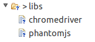
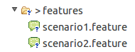
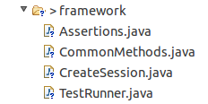
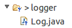
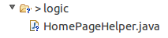
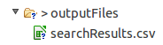
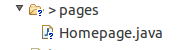
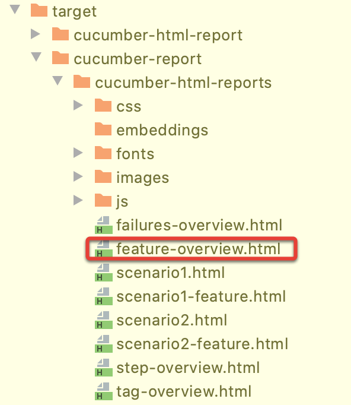
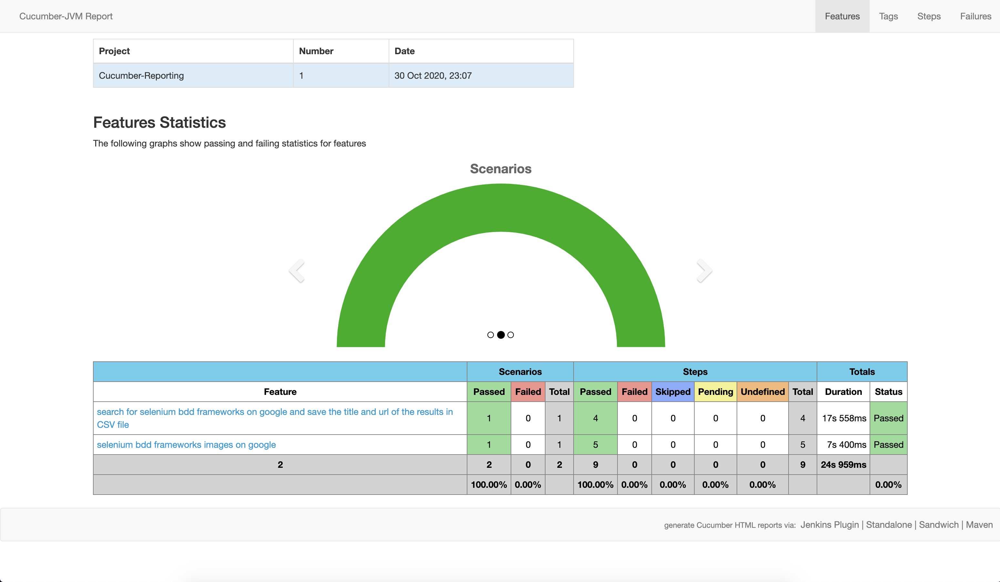

# selenium_BDD_framework

Behavioural driven development automation framework using selenium, cucumber-java, testng, maven, phantomjs

## Tools and technologies used:

1. Language: Java 8
2. Testing framework: Testng
3. BDD framework: Cucumber jvm
4. Automation tool: Selenium webdriver
5. Build tool: maven
6. Logging: log4j
7. Headless browser: Phantomjs
8. Reporting: [cucumber reporting](https://github.com/damianszczepanik/cucumber-reporting)

## Features of the framework
1. BDD framework using Cucumber-jvm. Feature files can be written easily using Given,When, Then etc.
2. Browser(chrome/firefox) can be configured at run time  from command line (or Continuous integration tool, if configured).
3. Tests can run in headless browser (Phantomjs) by passing a parameter at run time.
4. Screenshot would be taken if any scenario failed and saved under /outputFiles folder.
5. Html report gets generated after each test run and can be found /target/cucumber-html-report/index.html

**package: libs** : It has exe of chromedriver and phantomjs. This is required while creating the webdriver session.

**package: features** : It contains all different features (tests) files. 

**package: framework** : It includes the common classes (and methods) which are required by each test to perform actions. Below are classes in this package:

**Assertions.java** : It contains assertion methods like verifyEquals,screenshot etc. These can be used in any of the helper files to verify the actual result with expected result.

**CommonMethods.java** : It is a common repository for all the webdriver methods which are used in every class present under logic package to perform actions like click, findElement etc. Every new method which is being used in logic classes should be added in this class as well. It is to reduce the duplicate code. Each page class extends this class.

**CreateSession.java** : All the methods to create a new session and destroy the session after the test(s) execution is over. 

**TestRunner.java** : Features/tests to be executed are defined in this class. Other test configurations are also defined here.

**package: logger** : It contains Log.java class which contains methods to show the logs on console and save the logs in LogFile.txt of each run.

**package: logic :** contains all the classes where actions and assertions happens.

**pakage: outputFiles :** All the output files will be stored here (screenshots/csv/txt files)

**package: pages :** It has web elements corresponding to the specific page which is used by corressponding logic classes.

## Test report ##

Once test execution is completed, go to target/cucumber-report folder and open feature-overview.html file

You can see the test results at different level

# Setting up the project

Install the maven and clone the build then:

**$ cd selenium_BDD_framework**

**$ mvn clean install**

## Execution of tests  
There are 2 scenarios named as @scenario1 and @scenario2. Ran the tests on chrome54.0, firefox46 on ubuntu 14.04 64 bit

To run both scenarios (@scenario1 and @scenario2) (by default browser would be chrome):

**$ mvn test**

To run test with configurable browser (for firefox, use -Dbrowser=firefox)

**$ mvn test -Dbrowser=chrome**

To run tests headlessly

**$ mvn test -Dheadless=yes**

To run specific scenario:

**$ mvn test -Dcucumber.options="--tags @scenario2"**

To run multiple mentioned scenarios:

**$ mvn test -Dcucumber.options="--tags @scenario1,@scenario2"**
